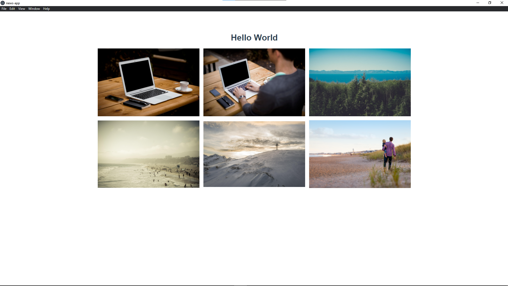

# news-app

<h1 align="center">
  
</h1>


## Sobre
 Primeiro projeto criado com Electron/Vue.
 Projeto feito para teste em processo seletivo da empresa [Milagro](https://milagro.cc/).

 

## Tecnologias usadas.
  - [ElectronJS](https://www.electronjs.org/)
  - [VueJS](https://vuejs.org/)


## Como inicializar o projeto
```
yarn install
```

### Compilar e fazer reload no ambiente de desenvolvimento
```
yarn serve
```

### Compilar e simplificar para produção
```
yarn build
```

### Concertar arquivos com lint.
```
yarn lint
```

### Configurações customizadas.
Veja [Configuration Reference](https://cli.vuejs.org/config/).
